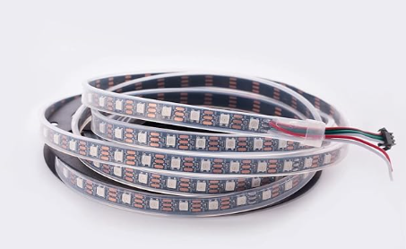
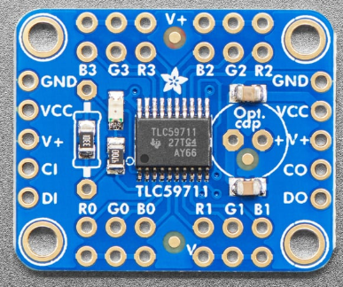

# LED Hardware

I have listed here the different components of the LED Hardware.

1. [LED Reel](https://www.amazon.com/WS2812B-Individual-Addressable-144Pixels-Non-Waterproof/dp/B09PBH3N6L/ref=sr_1_8?dib=eyJ2IjoiMSJ9.a78J0FnYsQJ7W2CuId3Dp0knf6sB_x2zrHmBPoa4cvYWP_JfqsX1bHq5-9lwRyDurrCnUhalrVXdQVUuYacoEazpeS2quF684JGgWvVvY5lh0FiOAInv-2dc0zLObjIc6wm9oN5kQK5DUzx_MpafCkZvfwR0zzpDDDmsYchTgI13APUr3dHClJLnO9XUF6WON8VZRz0a5dqY_ZgxtpOMlPMZCfJh2zEh8ri3RVECntPbrE5Hxa6LI_GiazFs80Srn5aBZPBxuIs_MdwwyUla3wJznUGuzmPCCnKYVvWfzbk.i546hnxeX-evPjvnFkPofw41ZxicNFzFwZQqoadrsNI&dib_tag=se&hvadid=670040602964&hvdev=c&hvexpln=0&hvlocphy=9031168&hvnetw=g&hvocijid=13105315360940684906--&hvqmt=b&hvrand=13105315360940684906&hvtargid=kwd-2059939939829&hydadcr=24334_13517547&keywords=ws2812b%2Brgb%2Bmodule&mcid=fd985980063c3554939a251937fa8c14&qid=1761191506&sr=8-8&th=1)

   
   
   I chose to get 5M so that I had the most wiggle room with the LEDs. They are relatively cheap and I could always cut them into little strips down the road.
3. [LED Driver](https://www.adafruit.com/product/1455?gad_source=1&gad_campaignid=21079267614&gbraid=0AAAAADx9JvTmJbkcPpc4Q2se-f91Nysap&gclid=CjwKCAjwgeLHBhBuEiwAL5gNEbACLwLLZXMsx7r6Jmkd17t4T07fPJSP1TLDgnYRraNMTIRD6_-bWBoCk4UQAvD_BwE)

   
   
   This will allow me to vary the brightness and color of the LEDs.

## Prospective Hardware

Eventually I would want LEDs in different parts of a room that may not be directly accessible to the FPGA. This warrents the use of ESP32 boards for wireless communication.
I may also need an audio sensing circuit if the onboard microphone isn't adequate. These aren't part of the original project idea, however, may be useful for next steps.
