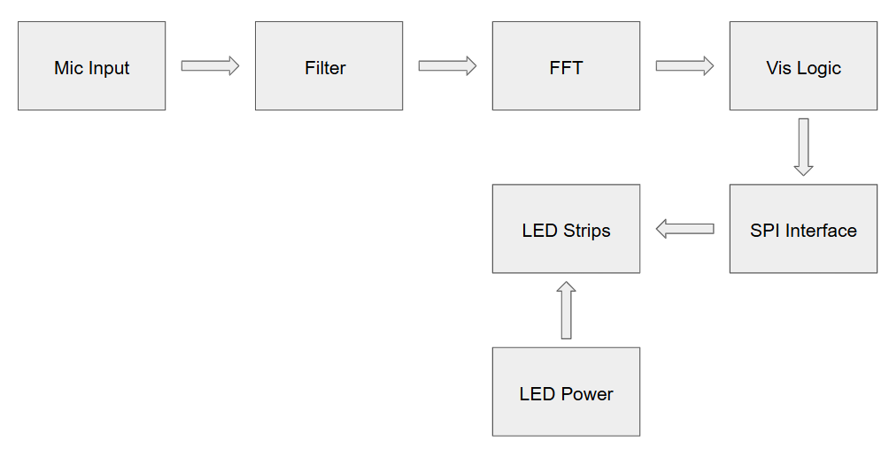

# Dancing LEDs
Giving LEDs the ability to dance! I am making and embedded system to sense environmental sounds and map its amplitude and frequency to the intensity and color of LEDs.

## Overview

System Block Diagram 

### 1. Hardware Selection
- [Dev Board Selection](Progress/Hardware-Selection/Development-Boards.md)

### 3. Hardware Development

### 5. Where to Go From Here
- Conclusion

## Current Stage
I have selected the board, and the initial components for a prototype. I am now developing the hardware logic.
